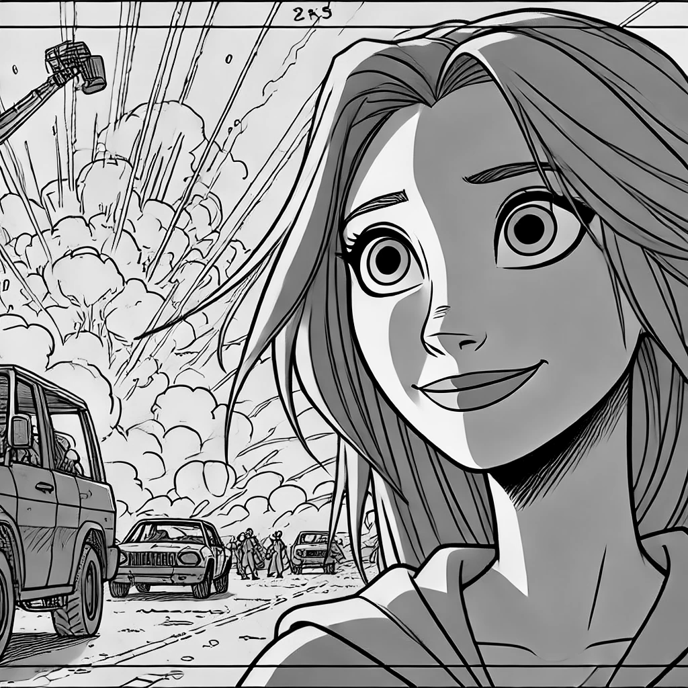
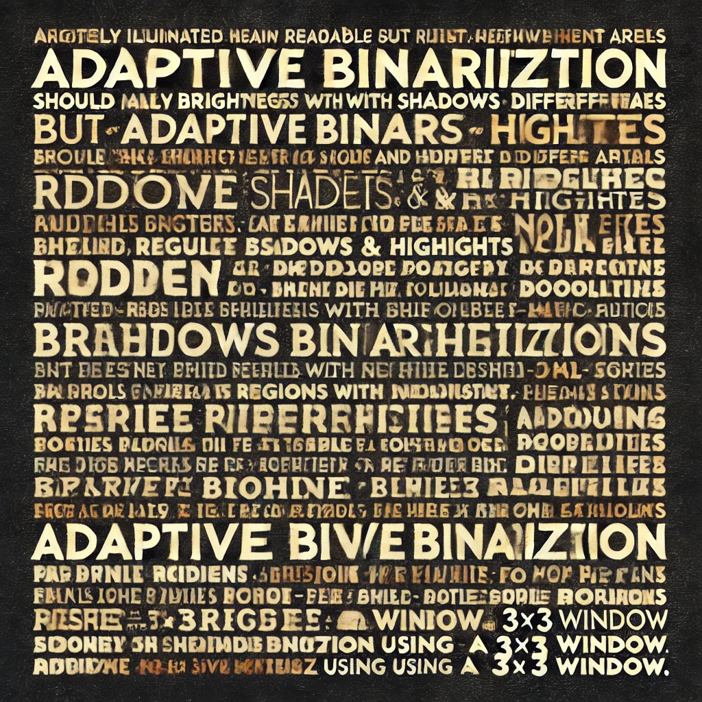

# Лабораторная работа №2. Обесцвечивание и бинаризация растровых изображений (алгоритмом Сауволы, размер окна 3, k = 0.3).
## Кадр из мультфильма
Оригинальное изображение:

Полутоновое изображение:

Бинаризованное изображение:

## Кадр из игры
Оригинальное изображение:

Полутоновое изображение:

Бинаризованное изображение (размер окна 3):

## Фотография человеческого лица
Оригинальное изображение:

Полутоновое изображение:

Бинаризованное изображение (размер окна 75):

## Фотография текста
Оригинальное изображение:

Полутоновое изображение:

Бинаризованное изображение:

## Выводы
Бинаризация методом Сауволы сильно зависит от размера окна и коэффициента k.
Данным методом хорошо обрабатываются однородные области. Неплохо поддаются бинаризации изображения с текстом 
(внутри букв, да и в целом на всем изображении присутствуют шумы типов как соли, так и перца). Края изображения 
обрабатываются хорошо (особенно заметно на изображениях с преобладающим черным фоном). Достаточно хорошо справляется с 
обработкой мультяшных персонажей.
