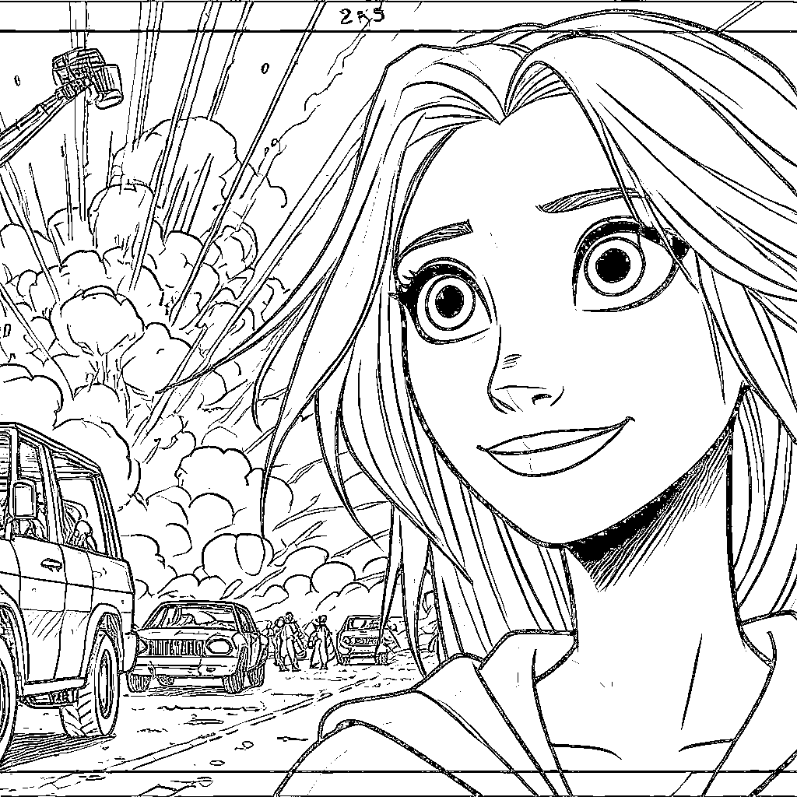
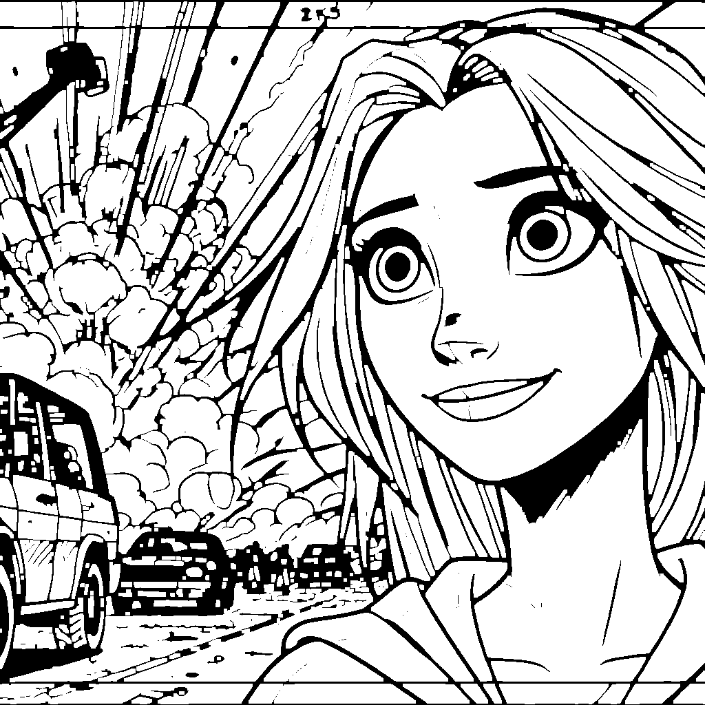
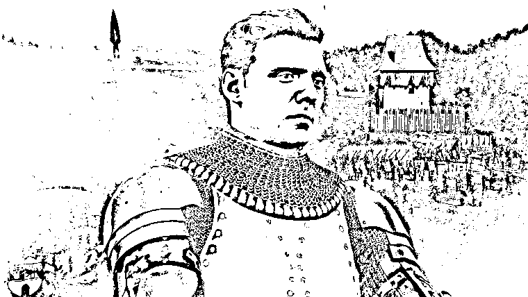
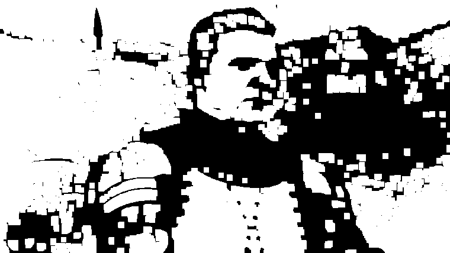
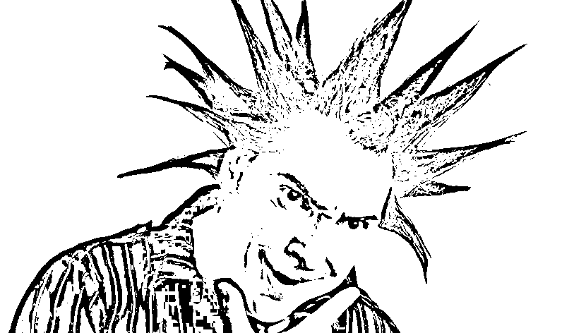
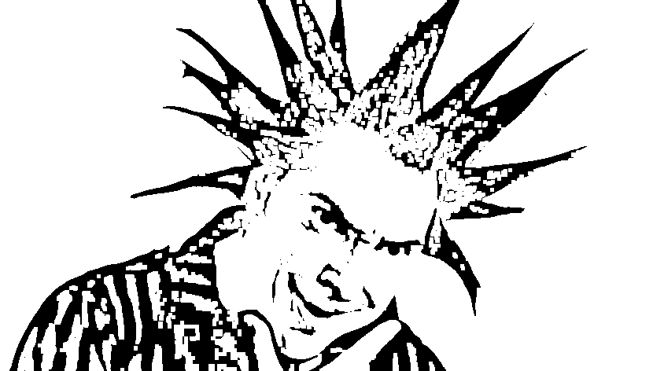
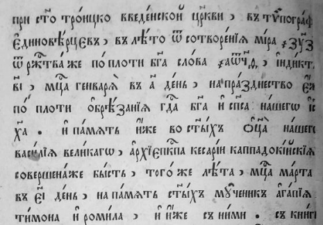
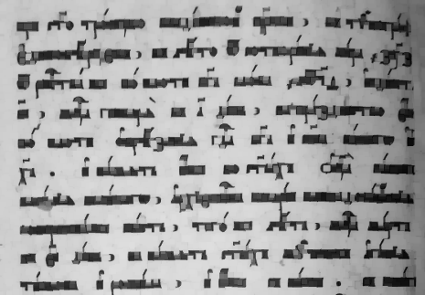

# Лабораторная работа №3. Фильтрация изображений и морфологические операции (морфологическое открытие) 

## Бинарное изображение мультика
Исходное изображение:

Морфологическое открытие

## Бинарное изобаржение игры:
Исходное изображение:

Морфологическое открытие

## Бинаризованное изображение человеческого лица
Исходное изображение:

Морфологическое открытие

## Бинаризованное фото текста
Исходное изображение: 

Морфологическое открытие

## Выводы
В зависимости от характера изображения, мы можем судить подходит или не подходит ему морфологическое открытие. 
Обычно лучшие результаты оно показывает на мультяшных изображениях и полутоновых, размывая изображения и убирая внешние 
дефекты, но оно плохо себя показывает на изображениях человеческого лица, убирая важные детали.
