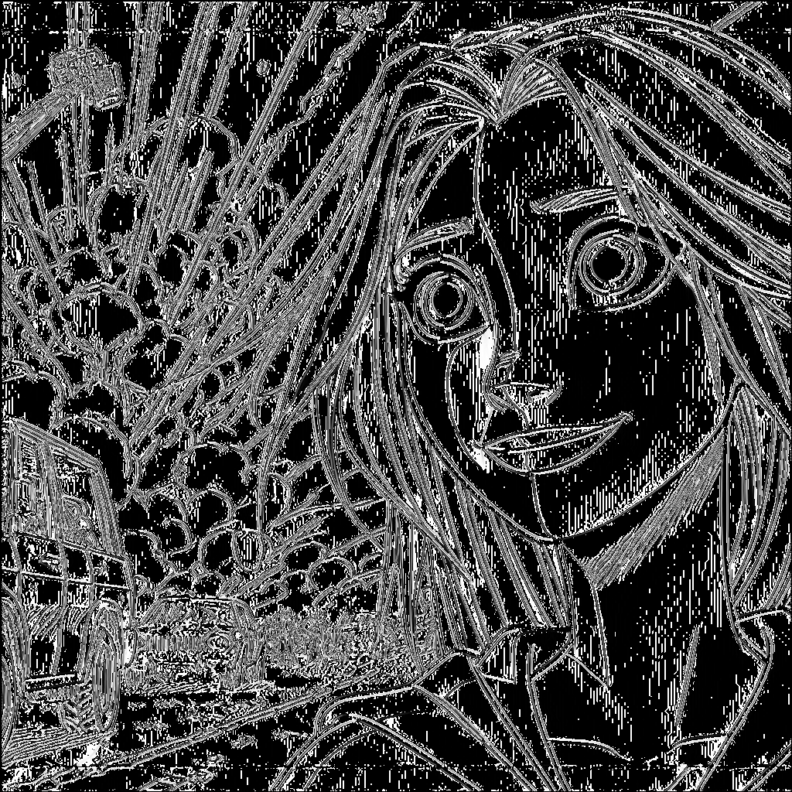
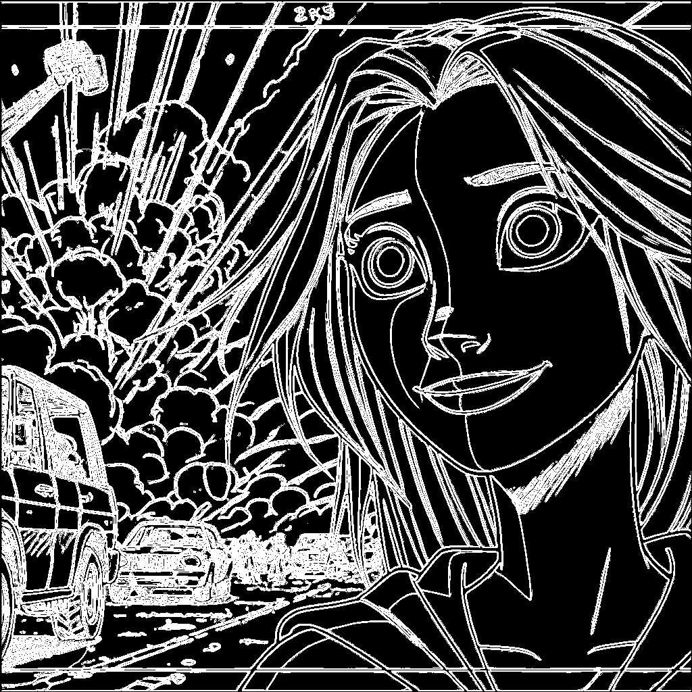

# Лабораторная работа №4. Выделение контуров на изображении.
Использовались оператор Круна и градиентная матрица $`G = |G_x| + |G_y|`$
## Кадр из мультфильма
Исходное изображение:

Градиент по Х:

Градиент по Y:

Градиентная матрица G:

Бинаризованная градиентная матрица G (Глобальная бинаризация, порог 15):

Бинаризованная градиентная матрица G (Саувола):

## Кадр из игры
Исходное изображение:

Градиент по Х:

Градиент по Y:

Градиентная матрица G:

Бинаризованная градиентная матрица G(Глобальная бинаризация, порог 30):

Бинаризованная градиентная матрица G(Саувола):

## Фото человеческого лица
Исходное изображение:

Градиент по Х:

Градиент по Y:

Градиентная матрица G:

Бинаризованная градиентная матрица G(Глобальная бинаризация, порог 15):

Бинаризованная градиентная матрица G(Саувола):

## Фото текста
Исходное изображение:

Градиент по Х:

Градиент по Y:

Градиентная матрица G:

Бинаризованная градиентная матрица G(Глобальная бинаризация, порог 45):

Бинаризованная градиентная матрица G(Саувола):

## Выводы
Алгоритм выделения контуров оператором Круна хорошо себя показывает для векторных и мультяшных изображений, но не очень 
хорошо работает для фотографий с изображениями людей и рукописным текстом. Ещё его не стоит использовать в случае если 
бинаризованное изображение получено методом Сауволы (для всех изображений видно, что выделение контуров намного лучше 
работает при глобальной пороговой бинаризации, потому что нет лишних шумов, как на изображении текста или лица человека).
