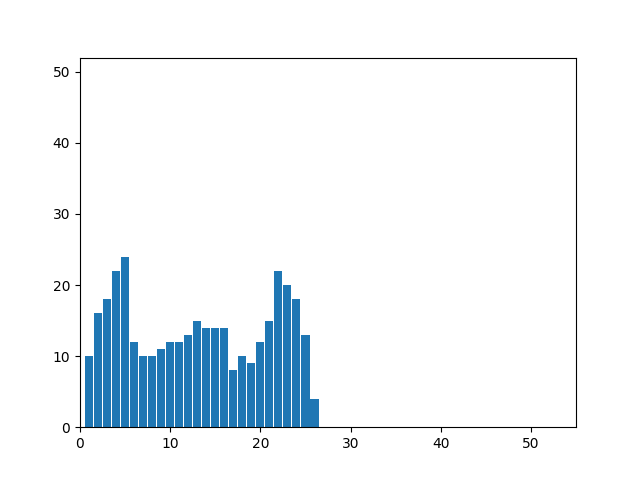

# Лабораторная работа №5. Выделение признаков символов.
Лабораторная работа проделывалась на грузинском алфавите. Тип букв -- обычные строчные,
шрифт NotoSansGeorgian-Regular, размер 52. В качестве демонстрации были выбраны 
6 символов, представляющих собой наибольший интерес. Квадраты для расчета веса черного расположены
следующим образом:

## Символ ბ (ба́ни)
Прямое и инвертированное сгенерированные изображения:

Профили буквы:

Признаки:
1. Вес первого квадрата: 79
2. Нормированный(на четверть площади) вес черного: 0.3122529644268774
3. Вес второго квадрата: 70
4. Нормированный(на четверть площади) вес черного: 0.2766798418972332
5. Вес третьего квадрата: 106
6. Нормированный(на четверть площади) вес черного: 0.4189723320158103
7. Вес четвертого квадрата: 103
8. Нормированный(на четверть площади) вес черного: 0.4071146245059288
9. Центр масс: (12.14245810055866, 21.61731843575419)
10. Нормированный центр масс: (0.4456983240223464, 0.5425610114672155)
11. Моменты инерции: (39894.57262569825, 20983.73463687153)
12. Нормированные моменты инерции: (0.3112775243102451, 0.1637256533571948)

## Символ ზ (зéни)
Прямое и инвертированное сгенерированные изображения:

Профили буквы:

Признаки:
1. Вес первого квадрата: 127
2. Нормированный(на четверть площади) вес черного: 0.4703703703703704
3. Вес второго квадрата: 87
4. Нормированный(на четверть площади) вес черного: 0.3222222222222222
5. Вес третьего квадрата: 93
6. Нормированный(на четверть площади) вес черного: 0.3444444444444444
7. Вес четвертого квадрата: 107
8. Нормированный(на четверть площади) вес черного: 0.3962962962962963
9. Центр масс: (12.347826086956522, 19.92270531400966)
10. Нормированный центр масс: (0.4364548494983277, 0.4851975721540938)
11. Моменты инерции: (56149.52657004834, 25163.91304347829)
12. Нормированные моменты инерции: (0.3276011492102986, 0.1468173880573542)

## Символ პ (па́ри)
Прямое и инвертированное сгенерированные изображения:

Профили буквы:

Признаки:
1. Вес первого квадрата: 24
2. Нормированный(на четверть площади) вес черного: 0.1
3. Вес второго квадрата: 97
4. Нормированный(на четверть площади) вес черного: 0.4041666666666667
5. Вес третьего квадрата: 74
6. Нормированный(на четверть площади) вес черного: 0.3083333333333333
7. Вес четвертого квадрата: 107
8. Нормированный(на четверть площади) вес черного: 0.4458333333333333
9. Центр масс: (13.774834437086092, 22.95364238410596)
10. Нормированный центр масс: (0.5554275842211345, 0.5629139072847682)
11. Моменты инерции: (42847.35099337744, 13214.688741721851)
12. Нормированные моменты инерции: (0.4697968399782624, 0.144891547977302)

## Символ ს (са́ни)
Прямое и инвертированное сгенерированные изображения:

Профили буквы:

Признаки:
1. Вес первого квадрата: 76
2. Нормированный(на четверть площади) вес черного: 0.3247863247863248
3. Вес второго квадрата: 38
4. Нормированный(на четверть площади) вес черного: 0.1623931623931624
5. Вес третьего квадрата: 97
6. Нормированный(на четверть площади) вес черного: 0.4145299145299145
7. Вес четвертого квадрата: 101
8. Нормированный(на четверть площади) вес черного: 0.4316239316239316
9. Центр масс: (9.82051282051282, 22.60897435897436)
10. Нормированный центр масс: (0.3835005574136009, 0.5686572199730094)
11. Моменты инерции: (35022.294871794846, 21761.94871794873)
12. Нормированные моменты инерции: (0.3597786701984184, 0.2235571654950354)

## Символ ქ (ка́ни)
Прямое и инвертированное сгенерированные изображения:

Профили буквы:

Признаки:
1. Вес первого квадрата: 75
2. Нормированный(на четверть площади) вес черного: 0.2403846153846154
3. Вес второго квадрата: 156
4. Нормированный(на четверть площади) вес черного: 0.5
5. Вес третьего квадрата: 87
6. Нормированный(на четверть площади) вес черного: 0.2788461538461538
7. Вес четвертого квадрата: 132
8. Нормированный(на четверть площади) вес черного: 0.4230769230769231
9. Центр масс: (14.237777777777778, 27.07777777777778)
10. Нормированный центр масс: (0.5755555555555556, 0.5113289760348584)
11. Моменты инерции: (100810.27777777782, 28103.55777777776)
12. Нормированные моменты инерции: (0.4978285322359398, 0.138783001371742)

## Символ ჭ (ча́ри)
Прямое и инвертированное сгенерированные изображения:

Профили буквы:

Признаки:
1. Вес первого квадрата: 99
2. Нормированный(на четверть площади) вес черного: 0.3046153846153846
3. Вес второго квадрата: 146
4. Нормированный(на четверть площади) вес черного: 0.4492307692307692
5. Вес третьего квадрата: 89
6. Нормированный(на четверть площади) вес черного: 0.2738461538461538
7. Вес четвертого квадрата: 132
8. Нормированный(на четверть площади) вес черного: 0.4061538461538461
9. Центр масс: (12.394849785407724, 27.09871244635193)
10. Нормированный центр масс: (0.4747854077253219, 0.5117394597323909)
11. Моменты инерции: (98251.4592274678, 22561.347639485)
12. Нормированные моменты инерции: (0.4524464404735204, 0.1038946547158954)

