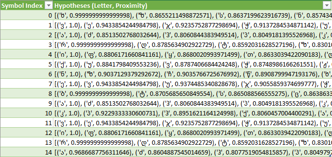
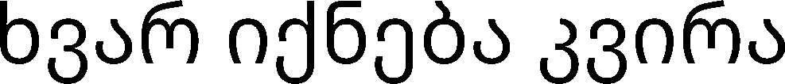
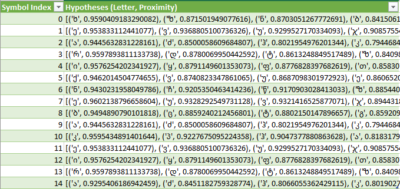

# Лабораторная работа №7. Классификация на основе признаков, анализ профилей.
Лабораторная работа выполнялась для грузинского алфавита, тип букв - строчные, шрифт - NotoSansGeorgian-Regular размера 52.

## Распознавание строки того же размера
### Исходное изображение

### Классификация символов
Лучшие гипотезы имеют следующий вид:

Получается следующее предложение:
ხვარიქნებაკვირა

**Анализ**

Классификация для того же размера шрифта работает хорошо, все буквы распознаются.

## Распознавание строки большего размера
### Исходное изображение

### Классификация символов
Лучшие гипотезы имеют вид:

Получается следующее предложение:
ხეარიქნებაკეირა

**Анализ**

При значительном увеличении шрифта точность распознавания значительно снижается.
Происходит потеря распознавания схожих в своих глифах символов, например:

ვ -> ე

Так что при большом увеличении классификация теряет актуальность.